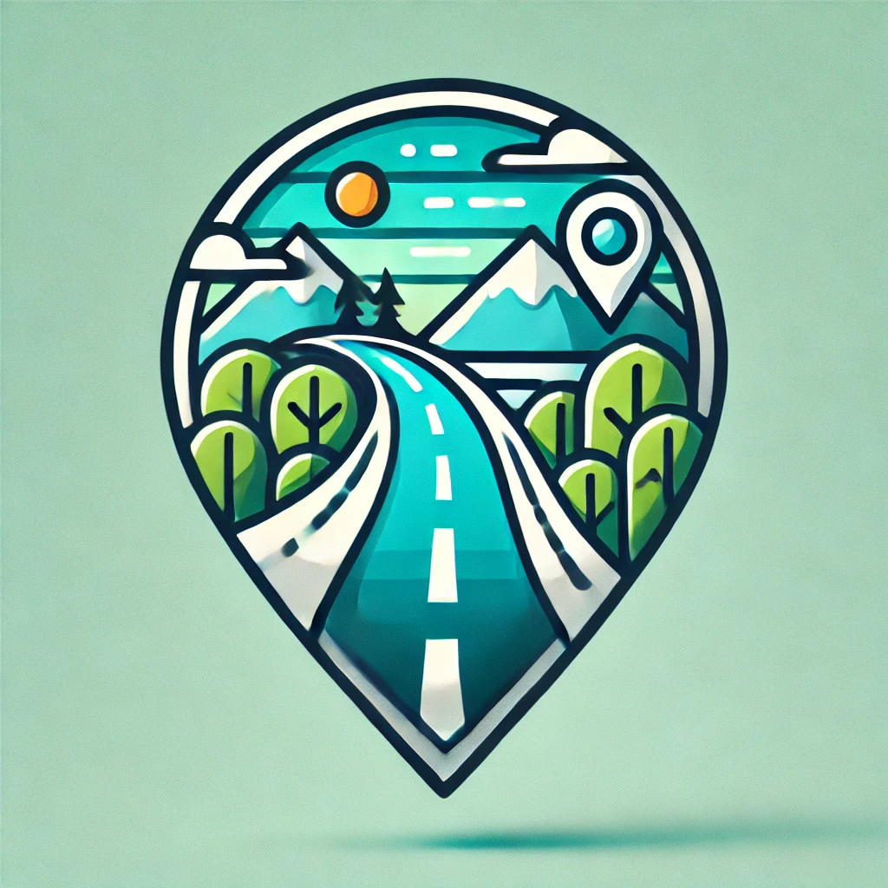

 

# TripMates

🚗 Visit TripMates App

[TripMates](https://www.tripmates.org/login)

🌟 Features:
- 📝 Plan your trip itinerary and store details like start date, end date, destination, and starting location.
- 💬 Automatically generate a trip summary with AI to capture the highlights of the trip.
- 🗺️ Keep all your past trips in one place, and easily view them anytime.

🚀 Get Started:
1. Sign up and create your account.
2. Start planning by creating a new trip.

---

👨‍💻 Developer Documentation:

### Tech Stack:
- **Frontend:** React
- **Backend:** Node.js, Express.js, Vercel
- **Database:** MySQL
- **API Integrations:** OpenAI API for trip summary generation & OpenStreetMaps for route

### Installation:
1. Clone the repository:
  ```bash
  git clone https://github.com/eflaatten/trailmates-frontend.git
  ```

2. Install dependencies:
  ```bash
  npm install
  ```

3. Start the development server:
  ```bash
  npm start
  ```
